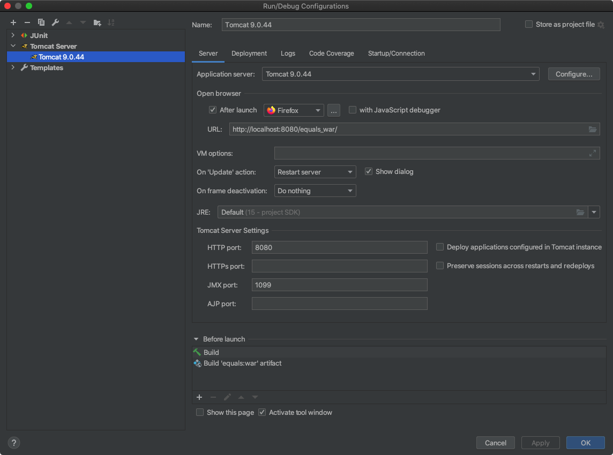
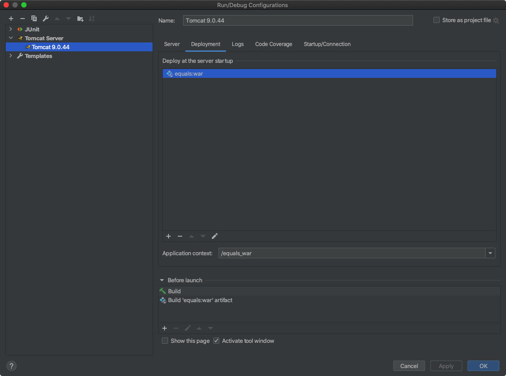

# EQualS

**CAS Software Development (SD-HS20)**

Group 1:

* Raphael Gerber @gerbr19
* Christophe Leupi @leupc1
* Sabina Löffel @loffs2
* Igor Stojanovic @stoji2

## Ressources

* [Project report](https://gitlab.ti.bfh.ch/cassd2021gruppe1/equals/-/blob/master/docs/Projektbericht_Equals_Gruppe1.pdf)
* [Single Page Application](http://localhost:8080/equals_war)
* [REST API](http://localhost:8080/equals_war/api)
* [Swagger API Documentation & Interaction](http://localhost:8080/equals_war/swagger)
* JavaDoc: `docs/javadoc/index.html`

## Installation

Initialize the MySQL database using the supplied [SQL scripts](https://moodle.bfh.ch/mod/resource/view.php?id=1227593) and the following settings:

* Database Name: `equalsdb`
* Username: `root`
* Password: `root`
* Port: `3306`

In order to run the application with Tomcat, the following settings must be made in IntelliJ:

